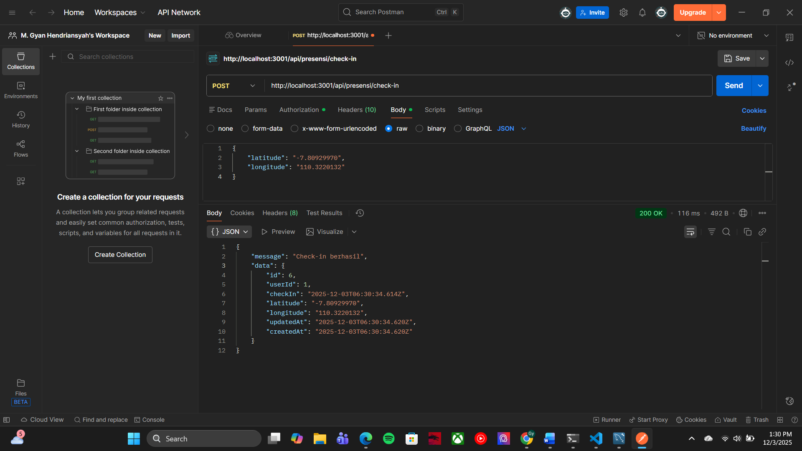
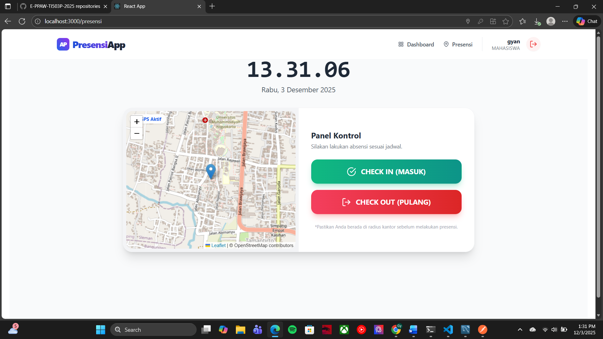
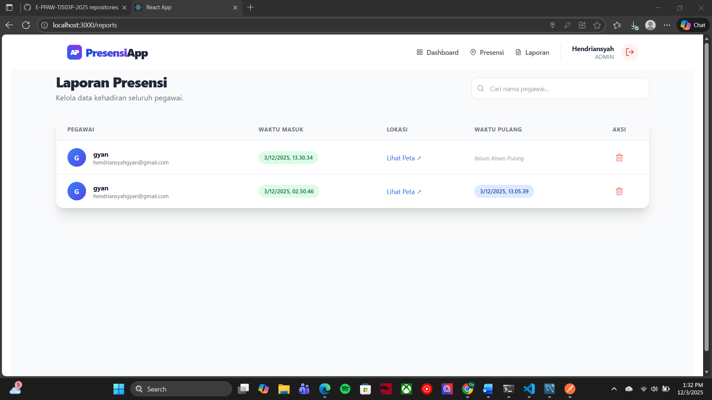
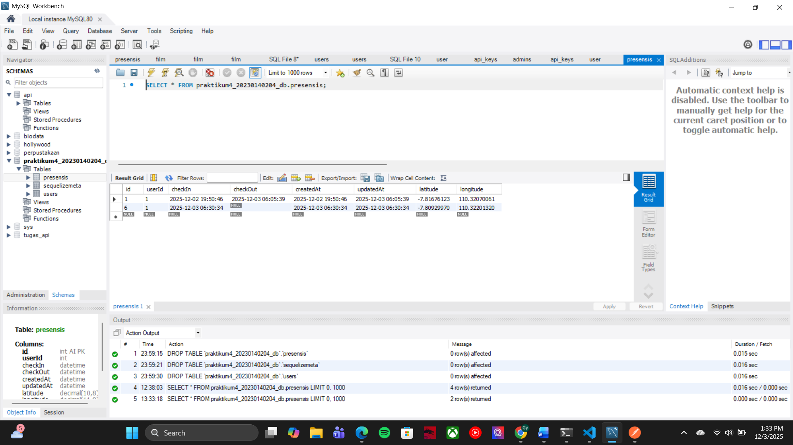

# Laporan Praktikum Pertemuan 9

---

### 1. Endpoint Presensi/Check-in (Postman)
Bukti endpoint `POST /check-in` berhasil menerima token dan koordinat lokasi.

---

### 2. Tampilan Halaman Presensi (Maps OSM)
Bukti halaman presensi berhasil mendeteksi lokasi, menampilkan peta, dan melakukan Check-In/Check-Out.

**Status Check-In Berhasil:**

---

### 3. Tampilan Halaman Report
Bukti halaman laporan admin menampilkan data presensi dari semua user (Nama user sudah muncul).

---

### 4. Screenshot Tabel Presensi di Database
Bukti data latitude dan longitude tersimpan di tabel `Presensis` MySQL.

